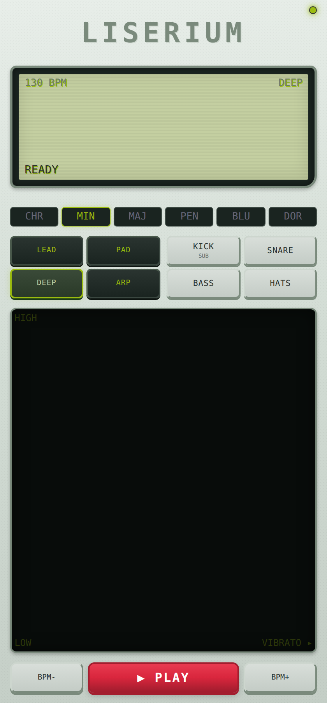

# LISERIUM

> A pocket-sized retro synth that lives in a single HTML file.

<p align="center">
  
</p>

<p align="center">
  <a href="https://limbrow.github.io/liserium/"><strong>▶ Try it live</strong></a>
  ·
  <a href="#features">Features</a>
  ·
  <a href="#controls">Controls</a>
  ·
  <a href="#tech">Tech</a>
</p>

---

Liserium is a touch-first web synthesizer with a Game Boy-flavored UI. Pick a synth voice, choose a scale, drag your finger across the pad to play, and tap the sequencer to lay down drums underneath. No accounts, no installs — open the page and make noise.

It is built as **one self-contained HTML file**: drop it on any static host (or open it locally) and it just works.

## Features

- **Four synth voices** — `LEAD`, `PAD`, `DEEP`, `ARP` — each with its own oscillator, envelope and effect chain.
- **Four-piece drum kit** — `KICK` (with three variants: SUB / PUNCH / DEEP), `SNARE`, `BASS`, `HATS`.
- **16-step sequencer** — tap any step to program a drum hit on the currently selected drum voice.
- **Scale-locked touch pad** — vertical axis = pitch, horizontal axis = vibrato. Notes always quantize to the active scale, so it's basically impossible to play a wrong note.
- **6 scales** — Chromatic, Minor, Major, Pentatonic, Blues, Dorian.
- **Multi-touch** — play two notes at the same time on the pad.
- **Live oscilloscope** in the LCD-style screen.
- **Full mastering chain** — saturation → stereo widener → compressor → limiter, so even chaotic playing comes out loud and tight.
- **Designed mobile-first** — handles iOS Safari quirks (silent mode, viewport, safe areas) and Instagram in-app browser.

## Controls

| Area | What it does |
|---|---|
| **Touch pad** | Drag to play. Y = pitch, X = vibrato amount. Two fingers = two notes. |
| **LEAD / PAD / DEEP / ARP** | Selects the synth voice routed to the touch pad. |
| **KICK / SNARE / BASS / HATS** | Selects which drum the sequencer is editing. Tap `KICK` again to cycle its variant. |
| **Sequencer (16 cells)** | Tap any cell to toggle a hit at that step for the selected drum. |
| **CHR / MIN / MAJ / PEN / BLU / DOR** | Switches the active scale. |
| **▶ PLAY** | Starts/stops the sequencer transport. |
| **BPM- / BPM+** | Adjusts tempo (default: 130 BPM). |

## Run it

It's literally one file. Three options:

**1. Open it locally**
```bash
git clone https://github.com/limbrow/liserium.git
cd liserium
open index.html   # or just double-click it
```

**2. Serve it locally** (recommended for mobile testing on your LAN)
```bash
python3 -m http.server 8000
# then visit http://localhost:8000 (or http://<your-LAN-IP>:8000 from your phone)
```

**3. Deploy to GitHub Pages**
1. Push this repo to GitHub.
2. Go to **Settings → Pages**.
3. Set source to `main` branch, folder `/ (root)`.
4. Done — your synth is live at `https://<your-username>.github.io/liserium/`.

## Tech

- Vanilla **HTML / CSS / JavaScript** — no build step, no framework, no bundler.
- [**Tone.js 14.7**](https://tonejs.github.io/) for synthesis, sequencing and the audio mastering chain.
- Pointer Events API for unified mouse + touch + multi-touch input.
- Canvas 2D for the oscilloscope and pad grid.
- Pure CSS for the chunky retro chassis (no images, no SVG sprites — just gradients, box-shadows and a tiny inline SVG noise texture).

The whole thing weighs **~50 KB** of source. After the Tone.js CDN load, it runs entirely client-side.

## Project structure

```
liserium/
├── index.html      ← the synth (HTML + CSS + JS, all in one)
├── preview.png     ← screenshot used in the README
├── README.md
└── LICENSE
```

## Browser support

Tested and working on:

- ✅ Safari iOS (including silent-mode bypass)
- ✅ Chrome / Edge / Firefox desktop
- ✅ Chrome Android
- ✅ Instagram & TikTok in-app browsers

Audio requires a user gesture to start (browser policy), which is what the `TOUCH ME` splash button is for.

## License

MIT — see [LICENSE](LICENSE).

## Credits

Built by [@limbrow](https://limbrow.com). Audio engine powered by [Tone.js](https://tonejs.github.io/).

---

<sub>If you make something cool with it, I'd love to hear it. Tag me or open an issue.</sub>
